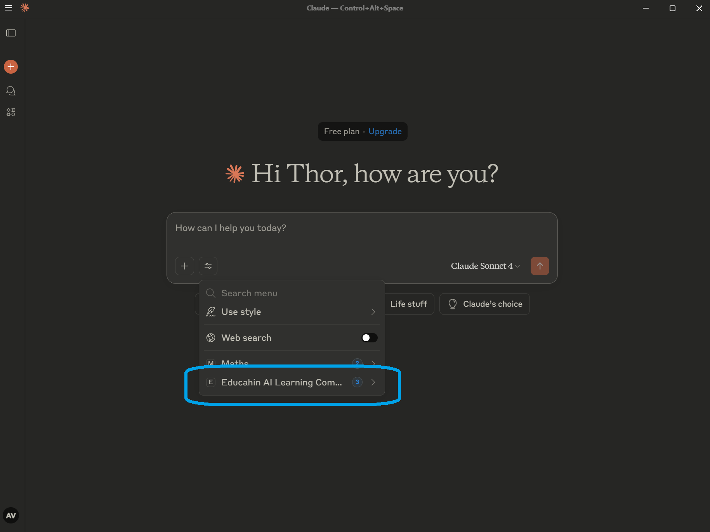
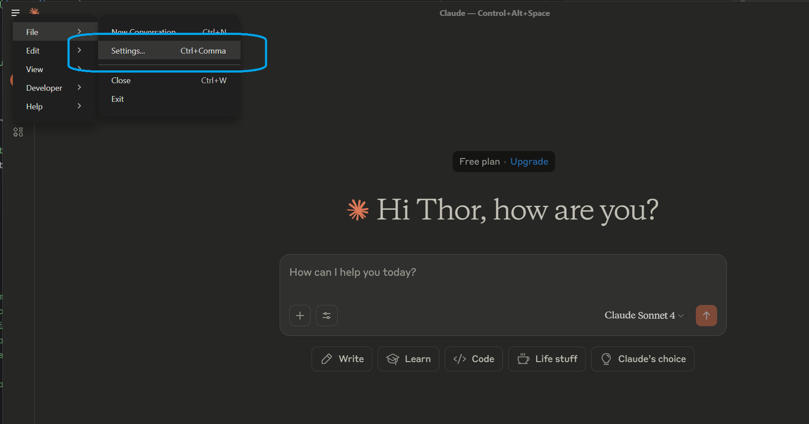
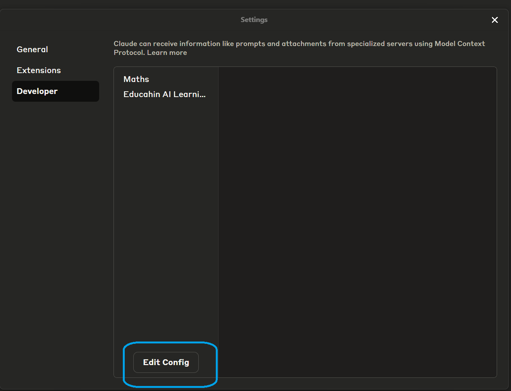
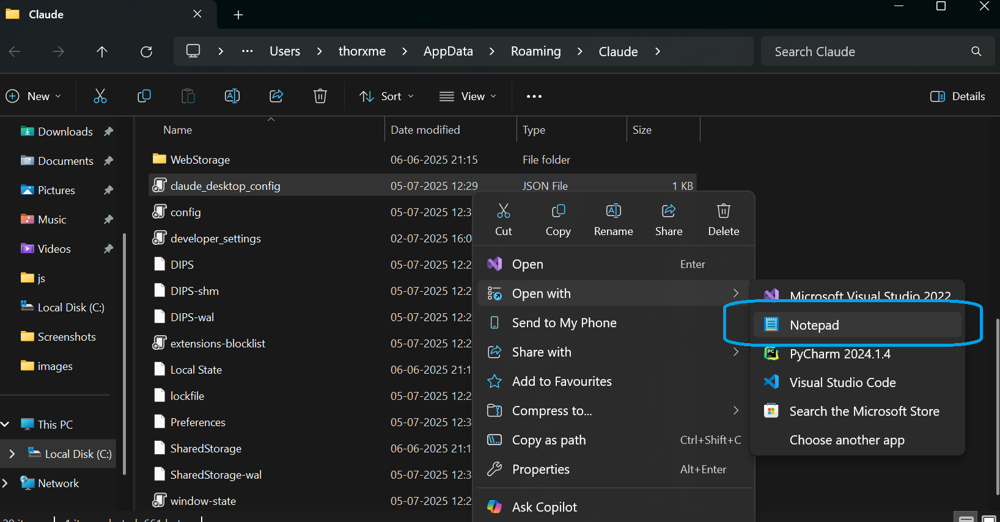
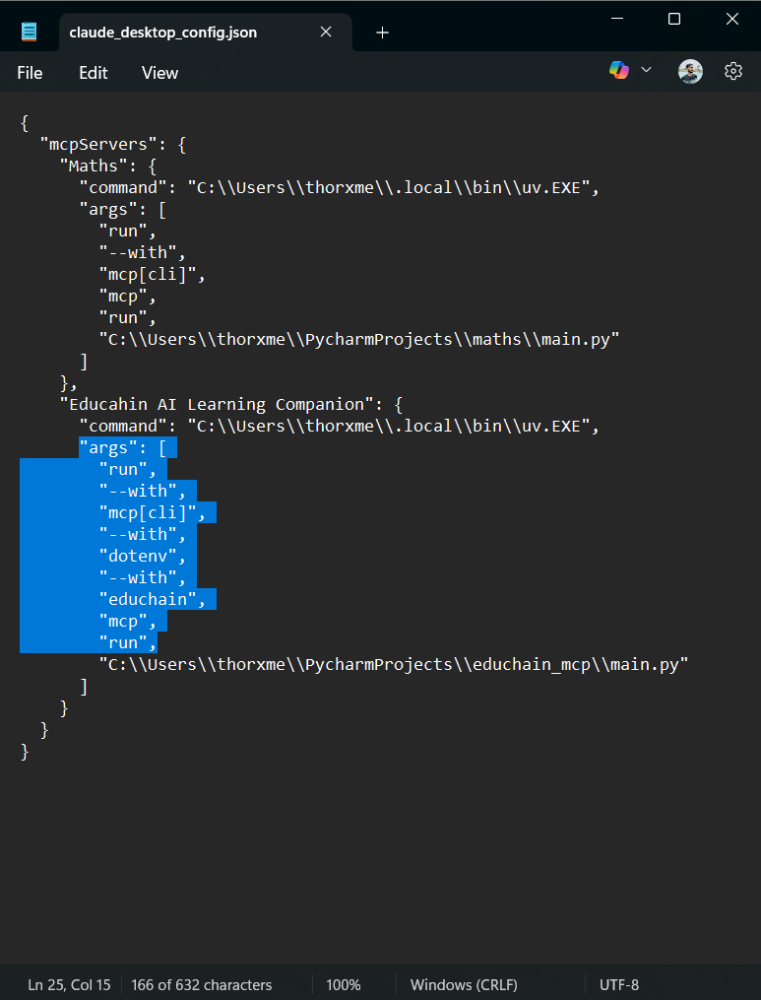

# 📚 Educhain AI Learning Companion

This is an Educhain MCP sever built using [Educhain](https://github.com/satvik314/educhain). It provides educational tools such as **automated MCQ generation** and **lesson planning** on any topic using Educahin SDK.

---

## 🚀 Features

* **Generate MCQs**: Automatically generate multiple-choice questions with explanations for any topic.
* **Create Lesson Plans**: Get structured, in-depth lesson plans tailored to any subject.
* **Generate different kinds of questions** (e.g. "True/False", "Fill in the Blank", or "Short Answer")

---

## 🛠️ Setup

Note: We are using uv for managing this python project, visit [uv installation steps](https://docs.astral.sh/uv/getting-started/installation/) for information about how to install uv on your system.

1. **Clone the repo** and navigate to the project folder.

    ```bash
   git clone https://github.com/thor-x-me/educhain_mcp.git 
   
   cd educhain_mcp
   ```

2. **Create virtual environment and activate it**:

    ```bash
    uv venv
    .venv\Scripts\activate
    ```

3. **Install dependencies**:

   ```bash
   uv pip install .
   ```

4. **Set your API key**:
   Create a `.env` file in root directory with:
    
   ```
   GOOGLE_API_KEY=your_google_genai_api_key
   ```
    Get your API key from [Google AI Studio](https://aistudio.google.com/app/apikey)
---

## 🧪 How to Use

Install the server:

```bash
uv run mcp install main.py
```

This will add the required configuration in the MCP config file in Claude for Desktop

You can then interact with the MCP tools using Claude for Desktop:

---


### 🧩 Available Tools

* **`generate_mcqs(topic, number_of_questions)`**
  Generates MCQs for a given topic.

* **`generate_lesson_plan(topic)`**
  Returns a structured lesson plan for any topic.

* **`generate_different_types_of_question_from_educhain(topic, number_of_questions, question_type, difficulty_level)`**
    Generates different kinds of questions(e.g."True/False", "Fill in the Blank", or "Short Answer") with educhian SDK 

---

## 📦 Project Structure

```
.
├── app.py               # Main entry script
├── gemini_llm.py        # Educhain implementation using gemini api
├── .env                 # Contains your Google API key
├── pyproject.toml       # configuration file for the project
├── uv.lock              # generated by uv to track dependencies 
├── README.md            # Setup explanation for the project
├── .gitignore           # files need not to be pushed on repository
├── .python-version      # Generated by uv for tracking python version
```

---

## 📚 Dependencies

* `educhain`
* `mcp[cli]`
* `python-dotenv`

---
## Debugging
If you face any error accessing the tools from the Educahin MCP server it is most likely because of missing dependencies in config file, follow these steps:

Step 1. Go to settings


Step 2: Go to Developer and then Edit config


Step 3: Now open the file in Notepad


Step 4: Paste the following arguments in "Args" except the last line which is the address of the main script added by uv.
```bash
    "args": [
        "run",
        "--with",
        "mcp[cli]",
        "--with",
        "dotenv",
        "--with",
        "educhain",
        "mcp",
        "run",
```



## 👤 Author

Abhishek Verma
---
